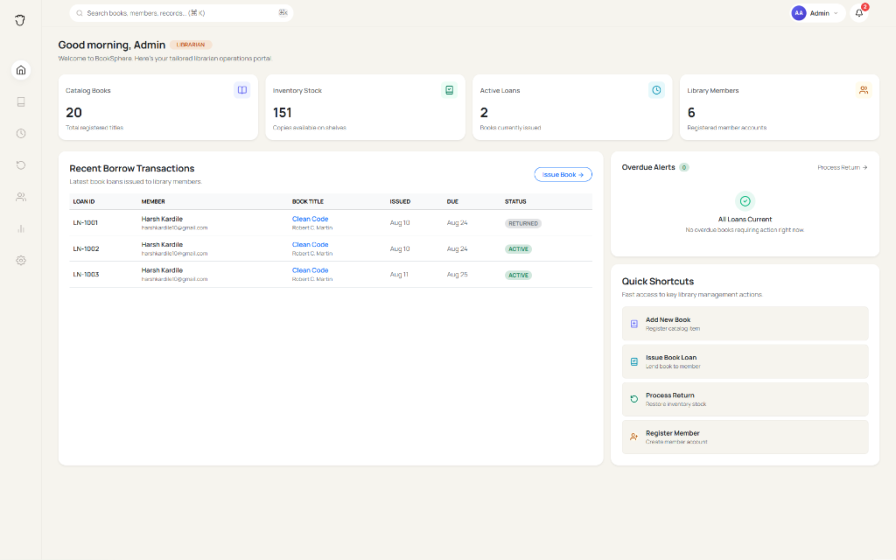
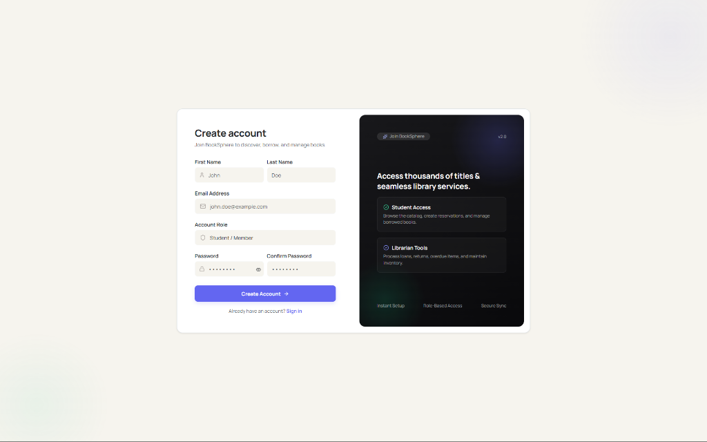
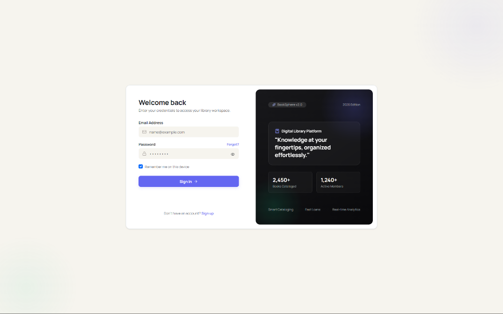
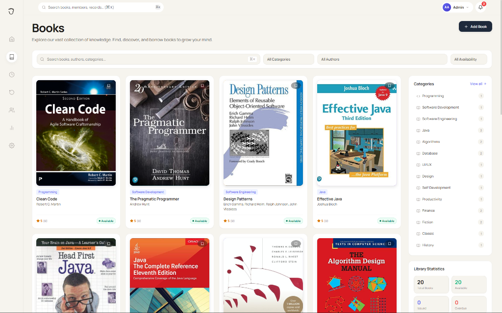
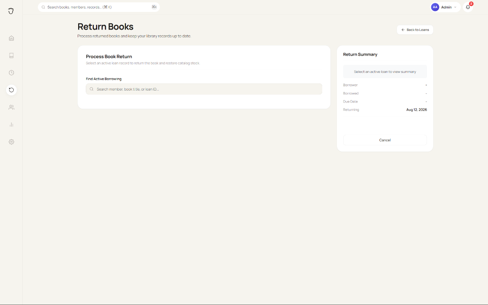

# 📚 BookSphere

<div align="center">



### **Modern, Enterprise-Grade Full-Stack Library Management System**

[](https://spring.io/projects/spring-boot)
[](https://react.dev/)
[](https://vitejs.dev/)
[](https://www.typescriptlang.org/)
[](https://www.mysql.com/)
[](https://jwt.io/)

</div>

---

## 📖 Table of Contents

- [Overview](#-overview)
- [Application Screenshots](#-application-screenshots)
- [Key Features](#-key-features)
- [Tech Stack](#-tech-stack)
- [System Architecture](#-system-architecture)
- [Project Directory Structure](#-project-directory-structure)
- [Getting Started](#-getting-started)
  - [Prerequisites](#prerequisites)
  - [1. Backend Setup (Spring Boot & MySQL)](#1-backend-setup-spring-boot--mysql)
  - [2. Frontend Setup (React & Vite)](#2-frontend-setup-react--vite)
- [API Documentation](#-api-documentation)
- [License](#-license)

---

## 🌟 Overview

**BookSphere** is a modern, enterprise-ready full-stack web application designed to automate and simplify core operations for academic, public, and institutional libraries. It replaces manual registers with a centralized, real-time digital management system.

The application features:
- **Stateless Security**: JWT token authentication with role-based authorization (`STUDENT`, `LIBRARIAN`, `ADMIN`).
- **Real-time Inventory Tracking**: Dynamic database-level stock management where issuing books decrements available count and returning restores stock automatically.
- **Modern User Experience**: Reactive Single-Page Application (SPA) built with React 19, Bootstrap 5, Lucide Icons, and dynamic toast notifications.

---

## 🖼️ Application Screenshots

### 1. Register Page
> User account creation interface supporting role selection (`STUDENT` or `LIBRARIAN`) with client-side form validation.



---

### 2. Login Page
> Secure authentication portal with JWT token issuance, error alerts, and persistent session support.



---

### 3. Dashboard Page
> Centralized administrative overview displaying real-time database KPIs (Total Books, Available Stock, Active Loans, Registered Members), recent transactions, and quick action shortcuts.


---

### 4. Book Catalog Page
> Dynamic book catalog featuring instant client-side search, category filters, availability badges, library statistics, and modal details views.



---

### 5. Borrow & Return Page
> Streamlined circulation workflow for active borrowing lookup, due date calculation, overdue penalty evaluation, and inventory restoration.



*(Additional feature screens will be added as new modules are released)*

---

## ✨ Key Features

### 🔐 Authentication & Security
- **Role-Based Access**: Role management for `STUDENT`, `LIBRARIAN`, and `ADMIN`.
- **Stateless JWT Session**: Secure token-based session management attached automatically to outgoing requests via Axios interceptors.
- **BCrypt Encryption**: Passwords encrypted using Spring Security's `BCryptPasswordEncoder`.

### 📚 Catalog Management
- **Full RESTful CRUD**: Create, read, update, and delete book entries (Title, Author, Publisher, ISBN, Category, Price, Quantity, Published Year, Image URL).
- **Instant Search & Filters**: Live filtering by title, author, category, and availability.

### 👥 Member Management
- **User Directory**: Centralized view of registered members with active loan histories and fine metrics.
- **Member CRUD**: Add, edit, or remove member accounts with instant table sync.

### 🔄 Circulation (Borrow & Return)
- **Stock-Aware Lending**: Issue books to registered members with automatic due-date calculation (default 14 days) and stock reduction.
- **Inventory Restoration**: Return books to restore stock inventory (+1) and track overdue days.

### 📊 Real-Time Analytics & Reports
- **Live Metrics**: Dashboard widgets reflecting exact counts from the MySQL database.
- **Circulation Reports**: Audit log table with CSV report export functionality.

---

## 🛠️ Tech Stack

### Backend
- **Framework**: Spring Boot 3.4.2
- **Language**: Java 21 / Java 26
- **Database**: MySQL 8.0+
- **ORM / JPA**: Spring Data JPA & Hibernate
- **Security**: Spring Security & JSON Web Tokens (`jjwt` 0.12.6)
- **Build Tool**: Maven

### Frontend
- **Framework**: React 19 (Vite 8 SPA)
- **Language**: TypeScript
- **Styling**: Vanilla CSS3, Bootstrap 5.3, Lucide React Icons
- **State Management**: Zustand
- **Form & Validation**: React Hook Form, Zod
- **HTTP Client**: Axios with Request/Response Interceptors
- **Notifications**: Sonner Toast

---

## 📐 System Architecture

```
+-------------------------------------------------------------+
|                      React 19 SPA (Vite)                    |
|  [ Dashboard ]  [ Books Catalog ]  [ Members ]  [ Return ]  |
+------------------------------+------------------------------+
                               |
                        HTTP / REST APIs
                      (Authorization: Bearer <JWT>)
                               |
+------------------------------v------------------------------+
|                    Spring Boot 3.4 Backend                  |
|                                                             |
|  [ Security Filter / JwtAuthenticationFilter ]             |
|                                                             |
|  [ Controllers ] AuthController, BookController, etc.       |
|  [ Services ]    AuthService, BookService, BorrowService    |
|  [ Repositories] UserRepository, BookRepository, etc.       |
+------------------------------+------------------------------+
                               |
                           JDBC / SQL
                               |
+------------------------------v------------------------------+
|                        MySQL Database                       |
|   Tables: [ users ]    [ books ]    [ borrow_transactions ] |
+-------------------------------------------------------------+
```

---

## 📁 Project Directory Structure

```
BookSphere/
├── assets/
│   └── screenshots/
│       ├── register-page.png
│       ├── login-page.png
│       ├── dashboard-page.png
│       ├── books-page.png
│       └── borrow-page.png
│
├── backend/
│   ├── src/
│   │   ├── main/
│   │   │   ├── java/com/ibm/
│   │   │   │   ├── config/ (SecurityConfig, WebConfig, PasswordConfig)
│   │   │   │   ├── controller/ (AuthController, BookController, BorrowController, etc.)
│   │   │   │   ├── dto/ (LoginRequest, JwtResponse, BorrowRequest, etc.)
│   │   │   │   ├── entity/ (User, Book, BorrowTransaction, Role)
│   │   │   │   ├── exception/ (GlobalExceptionHandler, Custom Exceptions)
│   │   │   │   ├── repository/ (UserRepository, BookRepository, BorrowRepository)
│   │   │   │   ├── security/ (JwtService, JwtAuthenticationFilter, UserPrincipal)
│   │   │   │   ├── service/ (AuthService, BookService, BorrowService, UserService)
│   │   │   │   └── BooksphereApplication.java
│   │   │   └── resources/
│   │   │       └── application.properties
│   └── pom.xml
│
└── frontend/
    ├── src/
    │   ├── components/ (Navbar, Sidebar, Footer, LoadingSpinner, etc.)
    │   ├── layouts/ (AdminLayout, AuthLayout)
    │   ├── pages/ (Auth, Books, Borrow, Dashboard, Members, Reports, Return, Settings)
    │   ├── services/ (api.ts, auth.service.ts, book.service.ts, borrow.service.ts)
    │   ├── store/ (authStore.ts)
    │   ├── types/ (auth.ts, book.ts)
    │   ├── utils/ (constants.ts, storage.ts)
    │   └── validation/ (loginSchema.ts, registerSchema.ts)
    ├── package.json
    └── vite.config.ts
```

---

## 🚀 Getting Started

### Prerequisites
- **Java**: JDK 21 or higher
- **Node.js**: Node 18+ and `npm`
- **Database**: MySQL Server 8.0+ running on `localhost:3306`

---

### 1. Backend Setup (Spring Boot & MySQL)

1. **Create MySQL Database**:
   ```sql
   CREATE DATABASE booksphere_db;
   ```

2. **Configure Database Credentials**:
   Update `backend/src/main/resources/application.properties` (or set environment variables):
   ```properties
   spring.datasource.url=jdbc:mysql://localhost:3306/booksphere_db?useSSL=false&allowPublicKeyRetrieval=true&serverTimezone=UTC
   spring.datasource.username=root
   spring.datasource.password=root
   ```

3. **Build & Run Backend**:
   ```bash
   cd backend
   mvnw clean spring-boot:run
   ```
   The backend server starts on `http://localhost:8080`.

---

### 2. Frontend Setup (React & Vite)

1. **Install Dependencies**:
   ```bash
   cd frontend
   npm install
   ```

2. **Run Dev Server**:
   ```bash
   npm run dev
   ```
   The application will be accessible at `http://localhost:5173`.

---

## 🔌 API Documentation

| Endpoint | Method | Access | Description |
|---|---|---|---|
| `/auth/register` | `POST` | Public | Register new user account |
| `/auth/login` | `POST` | Public | Authenticate user & receive JWT token |
| `/books` | `GET` | Authenticated | Retrieve full catalog of books |
| `/books/{id}` | `GET` | Authenticated | Fetch specific book details |
| `/books` | `POST` | Admin / Librarian | Add new book to catalog |
| `/books/{id}` | `PUT` | Admin / Librarian | Update existing book entry |
| `/books/{id}` | `DELETE` | Admin | Delete book from catalog |
| `/users` | `GET` | Authenticated | Fetch all library members |
| `/users/{id}` | `PUT` | Admin | Update member details |
| `/users/{id}` | `DELETE` | Admin | Delete member account |
| `/borrows` | `GET` | Authenticated | Retrieve all borrowing transactions |
| `/borrows/active` | `GET` | Authenticated | Fetch currently active loans |
| `/borrows/issue` | `POST` | Librarian / Admin | Issue a book to a member |
| `/borrows/return/{id}` | `POST` | Librarian / Admin | Process return for a borrowed book |
| `/reports/summary` | `GET` | Admin / Librarian | Get aggregated operational metrics |

---

## 📄 License

Distributed under the MIT License. See `LICENSE` for more information.

<div align="center">
  <sub>Built with ❤️ for Modern Digital Libraries</sub>
</div>
