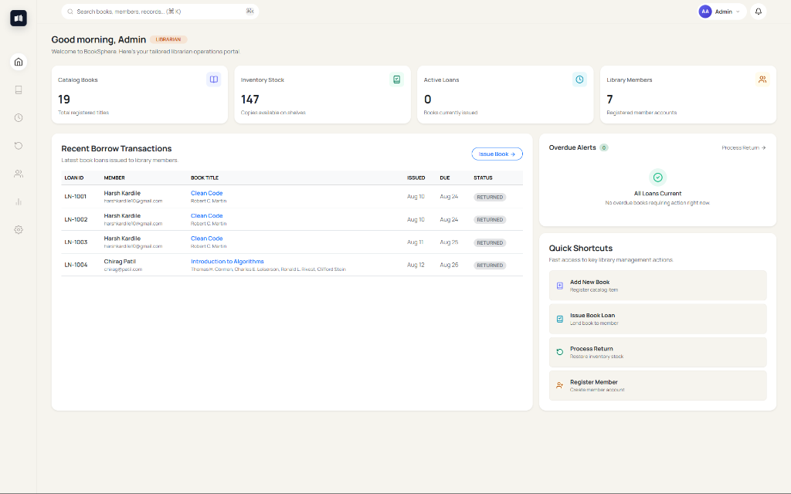
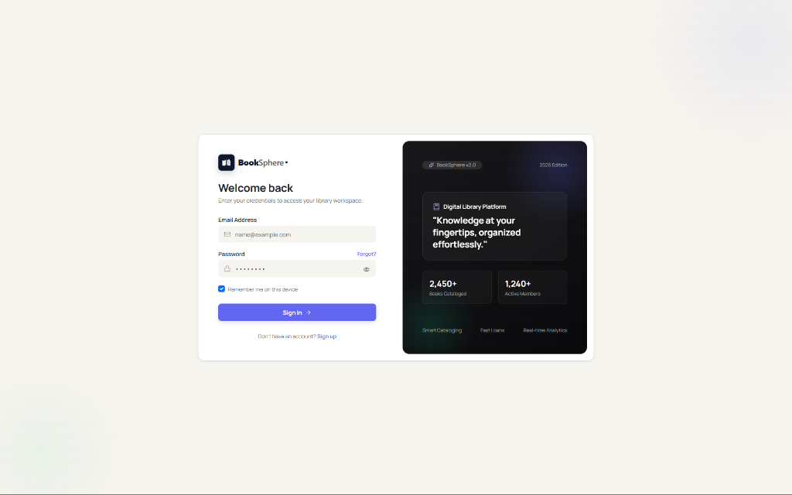
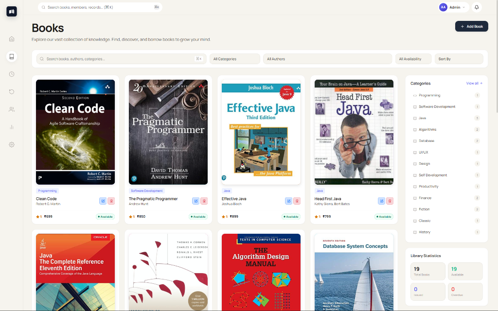
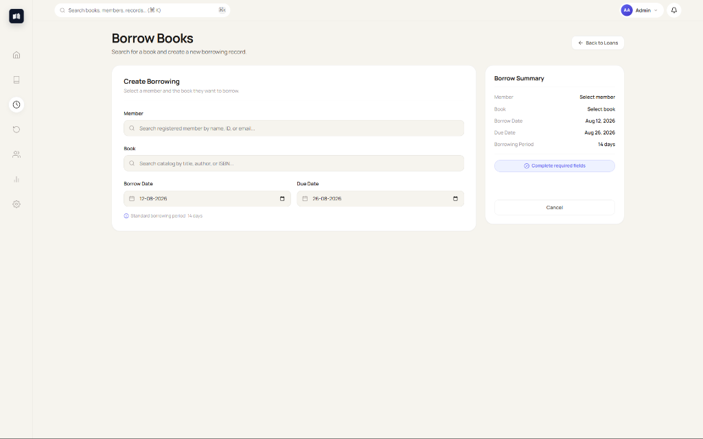
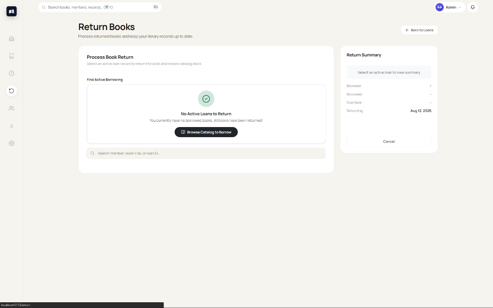
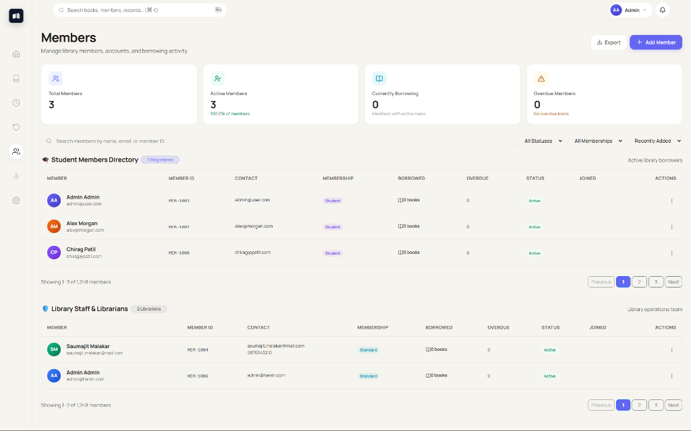
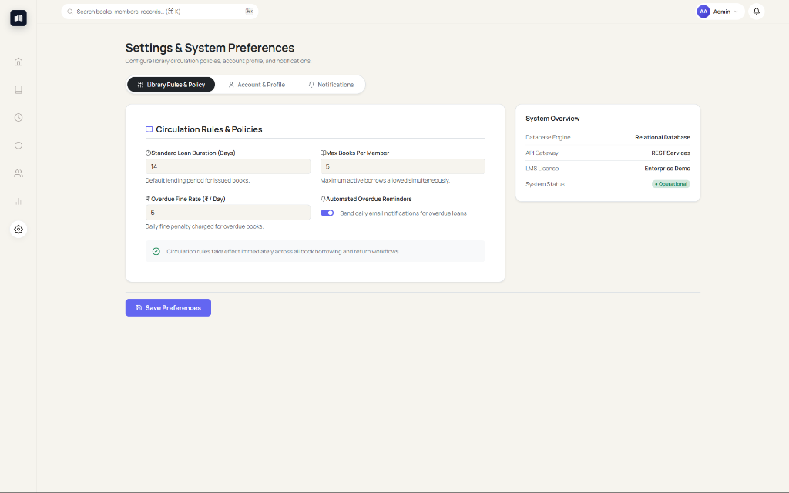

# 📚 BookSphere

<div align="center">



### **Modern, Enterprise-Grade Full-Stack Library Management System**

[](https://spring.io/projects/spring-boot)
[](https://react.dev/)
[](https://vitejs.dev/)
[](https://www.typescriptlang.org/)
[](https://www.mysql.com/)
[](https://jwt.io/)

</div>

---

## 📖 Table of Contents

- [Overview](#-overview)
- [Application Screenshots](#-application-screenshots)
- [Key Features](#-key-features)
- [Role-Based Workflows](#-role-based-workflows)
- [Tech Stack](#-tech-stack)
- [System Architecture](#-system-architecture)
- [Project Directory Structure](#-project-directory-structure)
- [Getting Started](#-getting-started)
  - [Prerequisites](#prerequisites)
  - [1. Backend Setup (Spring Boot & MySQL)](#1-backend-setup-spring-boot--mysql)
  - [2. Frontend Setup (React & Vite)](#2-frontend-setup-react--vite)
- [API Documentation](#-api-documentation)
- [License](#-license)

---

## 🌟 Overview

**BookSphere** is a state-of-the-art, enterprise-ready full-stack digital library management system built with **Spring Boot 3** and **React 19**. It automates library administration, catalog search, book circulation, user management, and fine tracking across academic and public library institutions.

### Highlights:
- **Stateless Security**: Secure JWT authentication with role-based authorization (`STUDENT`, `USER`, `LIBRARIAN`, `ADMIN`).
- **Dynamic Book Cataloging**: Real-time price sorting, category filters, availability tracking, pagination (20 books/page), and full modal CRUD for librarians.
- **Synchronized Borrow & Return**: Stock-aware borrowing and return workflows with member pre-selection, live due date tracking, and automatic stock restoration.
- **Adaptive UX**: Role-customized dashboards, quick shortcuts, settings preferences, and mode-adaptive BookSphere logo.

---

## 🖼️ Application Screenshots

### 1. Register Page
> User account creation interface supporting role selection (`STUDENT` or `LIBRARIAN`) with client-side form validation.


---

### 2. Login Page
> Secure authentication portal with JWT token issuance, error alerts, and persistent session support.



---

### 3. Dashboard Page
> Centralized operational portal displaying real-time database KPIs (Catalog Books, Inventory Stock, Active Loans, Registered Members), recent transactions table, and role-tailored Quick Shortcuts.


---

### 4. Book Catalog Page
> Dynamic book catalog featuring instant client-side search, category filters, price sorting, availability badges, library statistics, and modal CRUD operations.



---

### 5. Borrow Books Page
> Streamlined borrowing workflow with automatic member pre-selection for students, catalog book search, and 14-day due date calculation.



---

### 6. Return Books Page
> Process returned books with active loan search, inventory stock restoration, and clean zero-loans empty state notice.



---

### 7. Members Directory Page
> Centralized member management directory split into Student Members and Library Staff & Librarians with membership status badges.



---

### 8. Settings & Preferences Page
> Role-adapted settings interface providing circulation policy controls, profile security, password management, and notification toggles.



---

## ✨ Key Features

### 🔐 Authentication & Security
- **Role-Based Authorization**: Distinct views and actions for `STUDENT`, `USER`, `LIBRARIAN`, and `ADMIN`.
- **JWT Token Management**: Automatic token storage and request interception via Axios.
- **Encrypted Credentials**: Password hashing via Spring Security `BCryptPasswordEncoder`.

### 📚 Book Catalog Management
- **Librarian CRUD**: Add new books (`POST /books`), update existing entries (`PUT /books/{id}`), and delete titles (`DELETE /books/{id}`).
- **Advanced Sorting & Pagination**: Sort by Price (Low to High / High to Low), Title (A-Z / Z-A), or Year with 20 items per page pagination.
- **Stock Tracking**: Automatic stock inventory reduction on issue (+1 restoration on return).

### 👥 Member Directory & Profiles
- **Member Directory**: Categorized view of registered students and library staff members.
- **Settings & Preferences**: Role-adapted preferences panel for personal profile updates, password changes, and read-only student policy overview.

### 🔄 Circulation (Borrowing & Returns)
- **Active Loan Synchronization**: Seamless state tracking connecting book issue transactions directly to return processing.
- **Zero-Loans Empty State**: Clean empty state alerts on `/return` when all books are returned.

---

## 🎭 Role-Based Workflows

| Capability / Feature | Student / Member | Librarian / Admin |
|---|:---:|:---:|
| Browse & Search Catalog | ✅ | ✅ |
| Sort Books by Price & Year | ✅ | ✅ |
| Issue Book Loan for Self | ✅ | ✅ |
| Issue Loan for Any Member | ❌ | ✅ |
| Return Borrowed Books | ✅ | ✅ |
| Add / Edit / Delete Books | ❌ | ✅ |
| Access Member Directory | ❌ | ✅ |
| Modify System Policy Rules | ❌ | ✅ |

---

## 🛠️ Tech Stack

### Backend
- **Framework**: Spring Boot 3.4.2
- **Language**: Java 21 / Java 26
- **Database**: MySQL 8.0+
- **ORM / Data Access**: Spring Data JPA & Hibernate
- **Security**: Spring Security & JSON Web Tokens (`jjwt` 0.12.6)
- **Build Tool**: Maven

### Frontend
- **Framework**: React 19 (Vite 8 SPA)
- **Language**: TypeScript
- **Styling**: Vanilla CSS3, Bootstrap 5.3, Lucide React Icons
- **State Management**: Zustand
- **HTTP Client**: Axios with Request & Response Interceptors
- **Notifications**: Sonner Toast

---

## 📐 System Architecture

```
+-------------------------------------------------------------+
|                      React 19 SPA (Vite)                    |
| [ Dashboard ] [ Books ] [ Borrow ] [ Return ] [ Members ]   |
+------------------------------+------------------------------+
                               |
                        HTTP / REST APIs
                      (Authorization: Bearer <JWT>)
                               |
+------------------------------v------------------------------+
|                    Spring Boot 3.4 Backend                  |
|                                                             |
|  [ Security Filter / JwtAuthenticationFilter ]             |
|                                                             |
|  [ Controllers ] AuthController, BookController, etc.       |
|  [ Services ]    AuthService, BookService, BorrowService    |
|  [ Repositories] UserRepository, BookRepository, etc.       |
+------------------------------+------------------------------+
                               |
                           JDBC / SQL
                               |
+------------------------------v------------------------------+
|                        MySQL Database                       |
|   Tables: [ users ]    [ books ]    [ borrow_transactions ] |
+-------------------------------------------------------------+
```

---

## 📁 Project Directory Structure

```
BookSphere/
├── docs/
│   └── images/
│       ├── register.png
│       ├── login.png
│       ├── dashboard.png
│       ├── books.png
│       ├── borrow.png
│       ├── return.png
│       ├── members.png
│       └── settings.png
│
├── assets/
│   └── screenshots/
│       ├── register.png
│       ├── login.png
│       ├── dashboard.png
│       ├── books.png
│       ├── borrow.png
│       ├── return.png
│       ├── members.png
│       └── settings.png
│
├── backend/
│   ├── src/
│   │   ├── main/
│   │   │   ├── java/com/ibm/
│   │   │   │   ├── config/ (SecurityConfig, WebConfig)
│   │   │   │   ├── controller/ (AuthController, BookController, BorrowController)
│   │   │   │   ├── dto/ (LoginRequest, JwtResponse, BorrowRequest)
│   │   │   │   ├── entity/ (User, Book, BorrowTransaction)
│   │   │   │   ├── repository/ (UserRepository, BookRepository, BorrowRepository)
│   │   │   │   └── service/ (AuthService, BookService, BorrowService)
│   │   │   └── resources/
│   │   │       └── application.properties
│   └── pom.xml
│
└── frontend/
    ├── src/
    │   ├── components/ (Sidebar, Header, Logo, BookCard, Modals)
    │   ├── pages/ (Auth, Books, Borrow, Dashboard, Members, Return, Settings)
    │   ├── services/ (api.ts, auth.service.ts, book.service.ts, borrow.service.ts)
    │   ├── store/ (authStore.ts)
    │   └── types/ (auth.ts, book.ts)
    ├── package.json
    └── vite.config.ts
```

---

## 🚀 Getting Started

### Prerequisites
- **Java**: JDK 21 or higher
- **Node.js**: Node 18+ and `npm`
- **Database**: MySQL Server 8.0+ running on `localhost:3306`

---

### 1. Backend Setup (Spring Boot & MySQL)

1. **Create Database**:
   ```sql
   CREATE DATABASE booksphere_db;
   ```

2. **Configure Connection**:
   Update `backend/src/main/resources/application.properties`:
   ```properties
   spring.datasource.url=jdbc:mysql://localhost:3306/booksphere_db?useSSL=false&allowPublicKeyRetrieval=true&serverTimezone=UTC
   spring.datasource.username=root
   spring.datasource.password=root
   ```

3. **Run Application**:
   ```bash
   cd backend
   mvnw clean spring-boot:run
   ```
   Backend API runs at `http://localhost:8080`.

---

### 2. Frontend Setup (React & Vite)

1. **Install Dependencies**:
   ```bash
   cd frontend
   npm install
   ```

2. **Run Dev Server**:
   ```bash
   npm run dev
   ```
   Frontend Web App opens at `http://localhost:5173`.

---

## 🔌 API Documentation

| Endpoint | Method | Access | Description |
|---|---|---|---|
| `/auth/register` | `POST` | Public | Register new user account |
| `/auth/login` | `POST` | Public | Authenticate user & receive JWT token |
| `/books` | `GET` | Authenticated | Retrieve full catalog of books |
| `/books/{id}` | `GET` | Authenticated | Fetch specific book details |
| `/books` | `POST` | Admin / Librarian | Add new book to catalog |
| `/books/{id}` | `PUT` | Admin / Librarian | Update existing book entry |
| `/books/{id}` | `DELETE` | Admin / Librarian | Delete book from catalog |
| `/users` | `GET` | Authenticated | Fetch registered library members |
| `/borrow` | `POST` | Authenticated | Issue a book to member |
| `/borrow/active` | `GET` | Authenticated | Fetch currently active loans |
| `/borrow/{id}/return` | `PUT` | Authenticated | Process return for borrowed book |

---

## 📄 License

Distributed under the MIT License. See `LICENSE` for details.

<div align="center">
  <sub>Crafted by Harsh Kardile, Saumajit Malakar & Vedant Wasdikar. Excellence isn’t optional.</sub>
</div>
